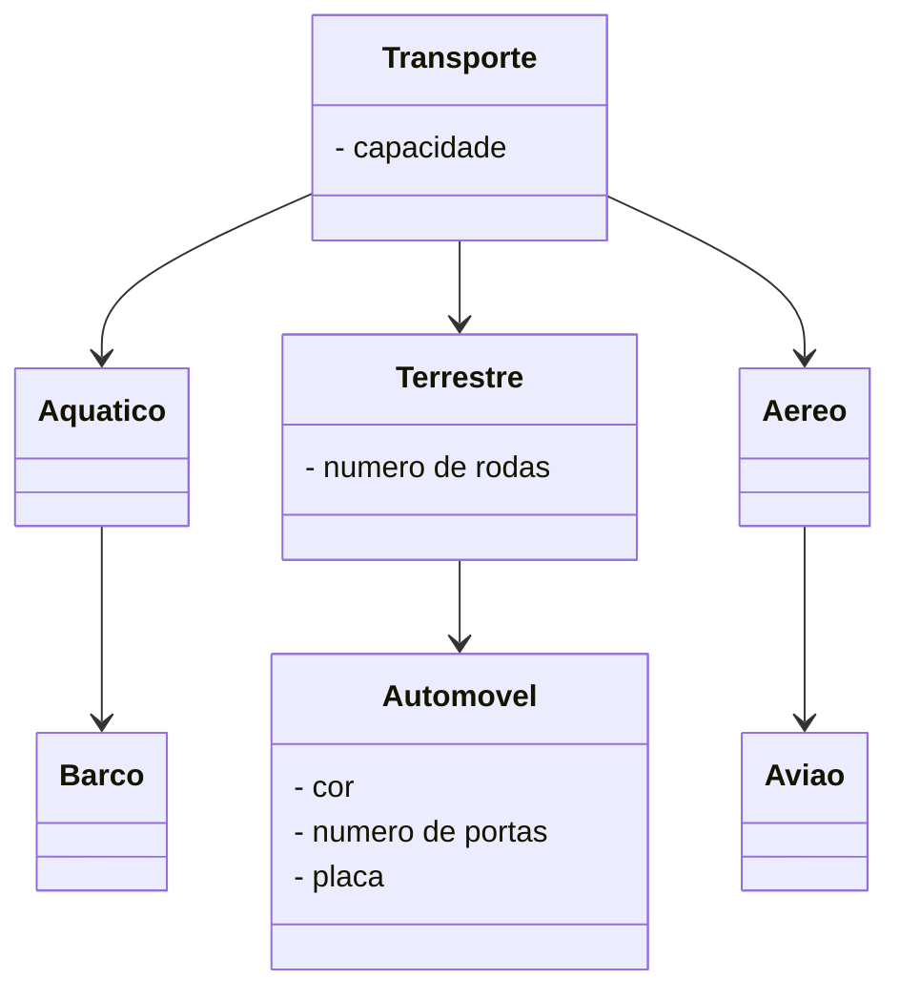
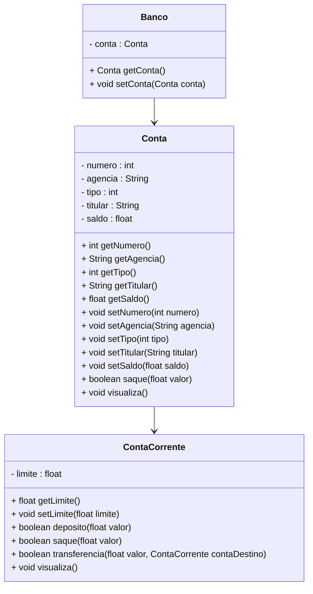

<h1>Programação Orientada a Objetos - Parte 02</h1>

Anteriormente, iniciamos nossos estudos sobre os conceitos iniciais da Programação Orientada a Objetos, tais como **Classes, Objetos, Métodos, Atributos e Encapsulamento**. Neste material veremos outros 2 conceitos fundamentais: **Herança e Polimorfismo**.

<h2>1. Herança</h2>

O que torna a Orientação a Objetos única é o **conceito de herança**. **Herança** é um mecanismo que permite que características comuns a diversas classes sejam fatoradas de uma classe base, ou **superclasse**, ou seja, permite uma Classe herdar todos os Atributos e Métodos de outra Classe. 

<div align="center"></div>

Analisando a imagem acima: 

- Considere **capacidade** como um atributo da **Classe Transporte**, que indica a quantidade de pessoas que o transporte em questão pode transportar.
- O atributo **numero de rodas** como um atributo da **Classe Terrestre**.
- Os atributos **cor, número de portas e placa** como atributos da **Classe Automóvel**.
- A imagem acima apresenta um exemplo de Herança, onde:
  - As **Classes Aquático, Terrestre e Aéreo** herdam a **Classe Transporte**.
  - A **Classe Barco** herda a **Classe Aquático**.
  - A **Classe Automóvel** herda a **Classe Terrestre**.
  - A **Classe Avião** herda a **Classe Aéreo**.

A herança é uma forma de reutilização de software em que novas classes são criadas a partir das classes existentes, absorvendo todos os seus atributos e métodos, além de adicionar novos recursos que as novas classes exigem. A partir de uma **classe base**, outras classes podem ser especificadas e cada classe derivada ou **subclasse** apresenta as características (estrutura e métodos) da **superclasse**, além de acrescentar o que for definido como particularidade da subclasse. Cada **subclasse** também se torna uma candidata a ser uma **superclasse** para alguma subclasse futura

Observando o exemplo acima:

- A **Classe Transporte** possui um **atributo chamado capacidade**.
- Como a **Classe Aquático** herda a **Classe Transporte**, pode-se dizer que ela também possui o **atributo capacidade**.
- A **Classe Barco**, como herda a **Classe Aquático**, também possui o **atributo capacidade**.

Abaixo, vemos o Diagrama de Classes do exemplo acima:



<h3>1.1. Tipos de Herança</h3>

Existem basicamente 2 tipos de herança:

- **Herança Simples:** Cada classe pode ter apenas uma superclasse. Na linguagem Java usa-se a palavra reservada **extends** para declarar que uma classe é herdeira de outra.
- **Herança Múltipla:** É a capacidade de uma classe possuir mais de uma superclasse e herdar os atributos e métodos
  de todas as superclasses. Java não implementa Herança Múltipla nativamente, como a Linguagem C++, por exemplo. Para simular a herança múltipla em Java, usa-se **Interfaces**, que veremos mais adiante.

<h3>1.2. Herança em Java</h3>

<div align="center"></div>

**Modificador de Acesso:** 

Determina como a Classe será manipulada no decorrer do desenvolvimento do programa, ou seja, a acessibilidade da Classe. Na tabela abaixo temos os Modificadores de visibildade:

Independentemente do moderador escolhido, um método pode ser chamado, a partir de qualquer outro método contido na mesma classe.

| **Modificador**            | **Descrição**                                                |
| -------------------------- | :----------------------------------------------------------- |
| **friendly<br />(Padrão)** | Uma  classe definida como friendly somente poderá ser acessada por objetos do mesmo pacote. |
| **public**                 | Uma  classe definida como pública poderá ser acessada por qualquer objeto em qualquer pacote. Uma  classe pública deve ser única no arquivo em que está declarada e o nome do arquivo deve ser igual ao da classe. |
| **final**                  | Uma  classe final pode ser instanciada, mas não pode ser derivada, isto é, não  pode ser superclasse de nenhuma subclasse. |
| **abstract**               | Classes  abstratas são aquelas que contém ao menos um método incompleto. Desse modo  uma classe abstrata não pode ser instanciada, mas pode ser derivada. Neste caso, a subclasse deve prover o corpo do método para que possa ser instanciada. |

A palavra reservada **extends** - indica que está sendo criada uma nova classe que deriva de uma classe existente

A **Classe existente** é a superclasse, classe base ou classe progenitora.

A **Nova classe** é a subclasse, classe derivada ou classe filha.

<h2>2. Criando a Classe Conta Corrente herdando a Classe Conta</h2>

Veja abaixo a implementação da Classe Conta Corrente herdando a Classe Conta:

```java
package com.generation.conta.model;

public class ContaCorrente extends Conta {

	private float limite;

	public ContaCorrente(int numero, String agencia, int tipo, String titular, float saldo, float limite) {
		super(numero, agencia, tipo, titular, saldo);
		this.limite = limite;
	}
	
	public float getLimite() {
		return limite;
	}

	public void setLimite(float limite) {
		this.limite = limite;
	}

	@Override
	public void sacar(float valor) {
		if(this.getSaldo() + this.getLimite() < valor)
			System.out.println("\n Saldo Insuficiente!");
		
		this.setSaldo(this.getSaldo() - valor);
	}
	
	public void depositar(float valor) {
		if (valor > 0)
			this.setSaldo(this.getSaldo() + valor);

	}
	
    @Override
	public void visualizar() {
		super.visualizar();
		System.out.println("Limite de Crédito: " + this.limite);

	}
	
}
```

A palavra-chave **super** refere-se a uma **SuperClasse**. Ela indica a chamada ao Método Construtor da **superclasse**. Caso a **superclasse** não possua um Método Construtor e o Método Construtor da **subclasse** não chamar nenhum outro Método Construtor da **superclasse** explicitamente o compilador java vai informar um erro.

Observe que na **Classe ContaCorrente** foram declaradas apenas **as diferenças (Métodos e Atributos)** entre a **subclasse** e **superclasse**, ou seja, o reuso é automático.

<h2>3. Sobrescrita de Métodos</h2>

O ato de sobrescrever um método ou propriedade significa dar uma nova forma ao mesmo, uma nova versão. Em Java, a  **sobrescrita** de **métodos** seria criar um novo **método** na classe filha contendo a mesma assinatura e mesmo tipo de retorno do **método** sobrescrito. (Override). 

Não confundir com a **sobrecarga** de Método, que no caso seria, o que permite **métodos** de mesmo nome, mas com suas assinaturas diferentes, coexistirem em uma mesma Classe.

A **sobrescrita** (ou override) está diretamente relacionada à orientação a objetos, mais especificamente com a herança. Com a **sobrescrita**, conseguimos especializar os **métodos** herdados das superclasses, alterando o seu comportamento nas subclasses por um mais específico.

Para indicar que um Método foi sobrescrito, utilizamos a anotação **@Override**.

> **Anotação:** Anotações são metadados que podem ser inseridos diretamente no código, para  “configurar” determinados recursos que antes deveriam ser feitos em  arquivos separados como, por exemplo, no XML. 
>
> **Metadados:** Metadados, ou Metainformação, são dados sobre outros dados. Um  item de um metadado pode dizer do que se trata aquele dado, geralmente  uma informação inteligível por um computador. Os metadados facilitam o  entendimento dos relacionamentos e a utilidade das informações dos  dados.

Veja no exemplo abaixo, o Método sacar da Classe Conta e o Método sacar da Classe Conta Corrente:

```Java
	// Método Sacar - Classe Conta
	public void sacar(float valor) {
		if (this.getSaldo() < valor)
			System.out.println("\n Saldo Insuficiente!");

		this.setSaldo(this.getSaldo() - valor);
	}

	// Método Sacar - Classe Conta Corrente
	@Override
	public void sacar(float valor) {

		if(this.getSaldo() + this.getLimite() < valor)
			System.out.println("\n Saldo Insuficiente!");
		
		this.setSaldo(this.getSaldo() - valor);
	}
```

Observe que as assinaturas dos Métodos são as mesmas, entretanto o **Método Sacar da Classe ContaCorrente**, além de de estar anotado com a anotação **@Override**, ele também possui uma implementação diferente, porquê uma conta corrente possui um limite de crédito que as outras contas não possuem, logo o Método foi sobrescrito porquê caso contrário o saque poderia ser bloqueado por motivo de saldo insuficiente.

Lembre-se que para que o Método sacar funcione diferente na Classe ContaCorrente, ele precisa ser sobrescrito por um simples motivo: A Classe ContaCorrente **não tem acesso direto** às variáveis de instância privadas da **superclasse**, ou seja, esse método não pode alterar diretamente a variável de instância **saldo**, embora cada objeto da Classe **ContaCorrente** tenha uma variável de instância **saldo**

Um ponto de atenção importante em relação a sobrescrita é que um **método redefinido em uma subclasse** com o **mesmo nome** e **mesma lista de parâmetros** que o **método em uma de suas classes antecessoras**, automaticamente oculta o método da classe ancestral (superclasse) a partir da subclasse, ou seja, ele passa a usar o Método da subclasse.

A **Classe Conta** também sofreu algumas alterações, como podemos ver abaixo:

```java
package com.generation.conta.model;

public class Conta {

	private int numero;
	private String agencia;
	private int tipo;
	private String titular;
	private float saldo;

	public Conta(int numero, String agencia, int tipo, String titular, float saldo) {
		this.numero = numero;
		this.agencia = agencia;
		this.tipo = tipo;
		this.titular = titular;
		this.saldo = saldo;
	}

	public Conta() {
	}

	public int getNumero() {
		return numero;
	}

	public void setNumero(int numero) {
		this.numero = numero;
	}

	public String getAgencia() {
		return agencia;
	}

	public void setAgencia(String agencia) {
		this.agencia = agencia;
	}

	public int getTipo() {
		return tipo;
	}

	public void setTipo(int tipo) {
		this.tipo = tipo;
	}

	public String getTitular() {
		return titular;
	}

	public void setTitular(String titular) {
		this.titular = titular;
	}

	public float getSaldo() {
		return saldo;
	}

	public void setSaldo(float saldo) {
		this.saldo = saldo;
	}

	public void sacar(float valor) {
		if (this.getSaldo() < valor)
			System.out.println("\n Saldo Insuficiente!");

		this.setSaldo(this.getSaldo() - valor);
	}

	public void visualizar() {

		String tipo = "";

		switch (this.tipo) {
		case 1:
			tipo = "Conta Corrente";
			break;
		case 2:
			tipo = "Conta INSS";
			break;
		}

		System.out.println("\n\n*********************************************************************");
		System.out.println("Dados da Conta:");
		System.out.println("*********************************************************************");
		System.out.println("Numero da Conta: " + this.numero);
		System.out.println("Agência: " + this.agencia);
		System.out.println("Tipo da Conta: " + tipo);
		System.out.println("Titular: " + this.titular);
		System.out.println("Saldo: " + this.saldo);

	}
}

```

As principais mudanças estão no atributo tipo que alteramos para int (atualizamos o respectivo Get e Set) e as implementações do Métodos sacar e visualizar que sofreram algumas alterações. Atualize a sua Classe Conta.

<h2>4. Recomendações sobre Herança</h2>

1. Sempre coloque os métodos e atributos comuns na **superclasse**
2. Use herança para modelar uma relação de “estar contido em” (um objeto da subclasse é um objeto da superclasse)
3. Não use herança a menos que todos ou a maioria dos métodos herdados façam sentido na subclasse


<h2>5. Polimorfismo</h2>

O poliformismo deriva da palavra polimorfo, que significa multiforme, ou que pode variar a forma.

Para a POO, polimorfismo é a habilidade de objetos de classes diferentes responderem a mesma mensagem de
diferentes maneiras, ou seja, várias formas de responder à mesma mensagem. O Polimorfismo é a capacidade de um objeto decidir que método aplicar a si mesmo, embora a mensagem possa ser a mesma, os objetos podem responder diferentemente.

**Veja o Exemplo abaixo:**

um dono de uma fábrica de brinquedos solicitou que seus engenheiros criassem um mesmo controle remoto para todos
os brinquedos de sua fábrica. A única restrição era que cada brinquedo atendesse aos comandos específicos definidos pelo controle.

<div align="center"></div>

Assim quando o brinquedo recebe o sinal MOVER, ele se move de acordo com a sua função:

- Para o avião, mover significa VOAR;
- Para o barco significa NAVEGAR, e
- Para o automóvel CORRER.

<div align="center"></div>

Observe que os brinquedos respondem ao mesmo sinal  de formas diferentes. O Polimorfismo permite que diferentes objetos (avião, barco, automóvel) respondam uma mesma mensagem (mover) de formas diferentes (voar, navegar e correr).

<h3>5.1. Como funciona na prática?</h3>

- Ao enviar uma mensagem que pede para uma **subclasse** aplicar um **método** usando certos parâmetros, a subclasse verifica se ela tem ou não um método com esse nome e exatamente com os mesmos parâmetros. 
- Se tiver, usa-o.
- Caso contrário: a **superclasse** torna-se responsável pelo processamento da mensagem e procura por um método com esse nome e esses parâmetros. 
- Se encontrar, chama esse método.

**Exemplo**: 

O método **sacar()** da classe **ContaCorrente** é chamado em vez do método **sacar()** da classe **Conta**, quando se envia a mensagem **sacar()** ao objeto da **Classe ContaCorrente**.

<h3>5.2. Tipos de Polimorfismo</h3>

O Polimorfismo pode ser classificado de três maneiras:

<h4>5.2.1. Polimorfismo de Sobrecarga (Sobrecarga de Método)</h4>

Permite que um método de determinado nome tenha comportamentos distintos, em função de diferentes parâmetros que ele recebe. Cada método difere no número e no tipo de parâmetros. Veja o exemplo abaixo:

```java
  	//Area do Quadrado
   	public static double Area(double x) {
    	    	
    	return x*x;
    }
     
   	//Area do Retângulo
   	public static double Area(double x, double y) {
    	
    	return x*y;
    }

```

Observe que no exemplo acima temos dois Métodos com o mesmo nome, entretanto com as assinaturas diferentes.

O **polimorfismo de sobrecarga** normalmente acontece sobre os **Métodos Construtores**, pois é comum para uma classe ter várias maneiras de instanciar um Objeto. Veja o exemplo abaixo:

```java
	public Conta(int numero, String agencia, String tipo, String titular, float saldo) {
		this.numero = numero;
		this.agencia = agencia;
		this.tipo = tipo;
		this.titular = titular;
		this.saldo = saldo;
	}
	
	public Conta() { }
```

Observe que no exemplo acima temos 2 Métodos Construtores com o mesmo nome, entretanto com as assinaturas diferentes. 

O construtor apropriado é chamado comparando a quantidade, os tipos e a ordem dos argumentos especificados na chamada do construtor com a quantidade, os tipos e a ordem dos parâmetros especificados na definição de cada construtor.

<h4>5.2.2. Polimorfismo de Sobreposição (Sobrescrita de Método)</h4>

É a redefinição de métodos em classes descendentes, ou seja, um método de uma classe filha com o mesmo nome de um método de uma classe mãe irá sobrepor esse último. O método redefinido tem precedência em relação a chamadas de método nos objetos da subclasse. Veja o Exemplo abaixo:

```Java
	// Método Sacar - Classe Conta
	public void sacar(float valor) {
		if (this.getSaldo() < valor)
			System.out.println("\n Saldo Insuficiente!");

		this.setSaldo(this.getSaldo() - valor);
	}

	// Método Sacar - Classe Conta Corrente
	@Override
	public void sacar(float valor) {

		if(this.getSaldo() + this.getLimite() < valor)
			System.out.println("\n Saldo Insuficiente!");
		
		this.setSaldo(this.getSaldo() - valor);
	}
```

Observe que no exemplo acima temos 2 Métodos de Classes diferentes, com implementações diferentes, porém com com o mesmo nome e com as mesmas assinaturas. 

<h4>5.2.3. Polimorfismo de Inclusão</h4>

Polimorfismo de inclusão usa a capacidade de substituição da herança de uma classe mãe por qualquer classe filha, para permitir um comportamento polimórfico nos métodos que usam a classe mãe. Veja o exemplo abaixo:

1) Vamos criar uma **Classe chamada Banco** que terá como parâmetro um **Objeto da Classe Conta**:


```Java
package com.generation.conta.model;

public class Banco {

	private Conta conta;

	public Banco(Conta conta) {
		this.conta = conta;
	}

	public Conta getConta() {
		return conta;
	}

	public void setConta(Conta conta) {
		this.conta = conta;
	}
	
}
```

2. Vamos testar a Classe Banco na Classe Menu:

```Java
package com.generation.conta;

import com.generation.conta.model.Banco;
import com.generation.conta.model.ContaCorrente;

public class Menu {

	public static void main(String[] args) {

		ContaCorrente contaCorrente = new ContaCorrente(123457, "123", 1, "Luisa Amaral", 5000.0f, 500.0f);
		Banco banco = new Banco(contaCorrente);
		banco.getConta().visualizar();
	}

}

```

Observe no exemplo acima que embora o **Método Construtor da Classe Banco esteja esperando por um Objeto da Classe Conta**, foi passado um **Objeto da Classe ContaCorrente**. Como a Classe Banco está relacionada com a Classe Conta e a Classe Conta Corrente é do tipo Conta (Herança), logo Conta pode ser substituída por ContaCorrente. Veja as relações no Diagrama abaixo:

## Diagrama de Classes



**A capacidade do objeto conta do tipo Conta, da classe Banco, receber qualquer um objeto de subclasses da classe Conta é o que caracteriza o polimorfismo de inclusão**.

<br /><br />

<div align="left"><a href="README.md">Voltar</a></div>
