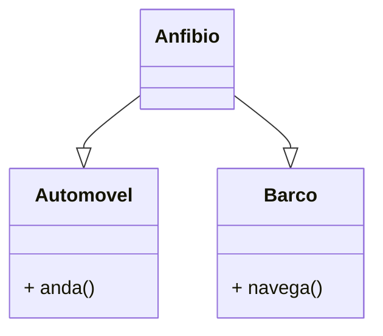
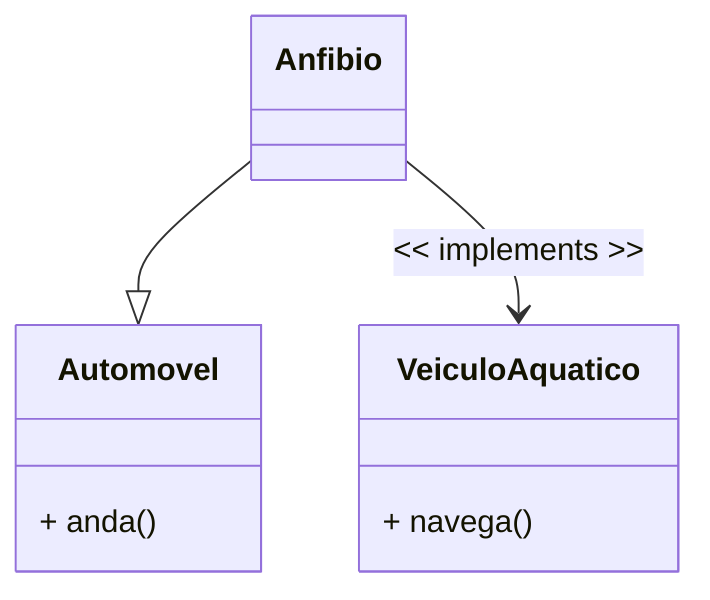

<h1>Interfaces</h1>

Como vimos no tópico Herança, Java permite a criação de uma Classe herdando as características de outra Classe, chamada Superclasse, com objetivo de simplificar o processo de desenvolvimento através da reutilização de código.

Entretanto, a linguagem Java não permite que uma classe seja derivada de duas ou mais classes (Polimorfismo), como no exemplo demonstrado na figura abaixo, ou seja, Java não permite a utilização do conceito de **Herança Múltipla**.

> •**Herança Simples** é o princípio, implementado em todas as linguagens de programação orientadas a objetos, que possibilita o compartilhamento de atributos e operações de apenas uma classe em uma subclasse. 
>
> •**Herança Múltipla** é o princípio, implementado em algumas linguagens de programação orientadas a objetos, como a liguagem C++ por exemplo, que possibilita o compartilhamento de atributos e operações de duas ou mais classes em uma subclasse, ou seja, uma classe pode ter mais de um superclasse.

Para contornar este fato, a Linguagem Java oferece uma solução elegante para este fim: o conceito de **Interfaces**, onde um Objeto "implementa" as características de outro Objeto.

**Interface** é uma estrutura que representa uma Classe abstrata "pura" em Java, que **não têm atributos de dados** (só pode ter constantes estáticas - tipo final), **não tem construtor**, **todos os métodos são abstratos** e **não é declarada como class, e sim como interface**.

Uma Classe pode implementar várias Interfaces, entretanto não é recomendável implementar mais do que 3 Interfaces, porquê pode criar uma complexidade desnecessária ao projeto.

A Interface estabelece **um conjunto de Métodos apenas assinados, ou seja, sem o corpo, que obrigatoriamente devem ser implementados nas Subclasses que a utiliza**. Abaixo vemos a sintaxe de como criar uma Interface:

Na imagem abaixo, vemos a sintaxe de como implementar uma Interface em uma Classe. Observe que as classes utilizam a palavra reservada **implements** na sua assinatura para implementar uma interface.

Vamos ao nosso exemplo:

Observe que **Corredor, Nadador e Ciclista** estendem (herdam) a Classe Atleta. Vamos acrescentar a **Classe Triatleta**.

Na imagem acima, vemos que a Classe **Triatleta** estenderia (herdaria) as 3 Classes: **Corredor, Nadador e Ciclista**.

Teoricamente isto funcionaria, mas na prática não, pois Java **NÃO ACEITA HERANÇA MÚLTIPLA**. Para resolvermos o problema, teríamos que implementar o conceito de **Interfaces**, onde **Atleta, Nadador, Corredor e Ciclista**, seriam as nossas **Interfaces**, enquanto **Pessoa e Triatleta** seriam as únicas classes.

<h2>Interfaces x Classes Abstratas</h2>

| Classes Abstratas                                           | Interfaces                                                   |
| ----------------------------------------------------------- | ------------------------------------------------------------ |
| Agrupa objetos com implementações compartilhadas            | Agrupa objetos com implementações diferentes                 |
| Define novas classes através de herança (simples) de código | Define novas interfaces através de herança (múltipla) de **assinaturas** |
| Só uma Classe pode ter apenas uma Superclasse               | Uma Classe pode ter várias Interfaces como supertipo         |

  

<a href="README.md">Voltar</a>

